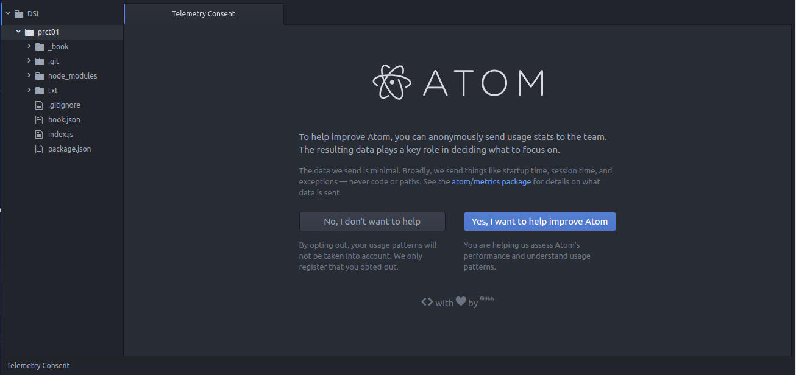

# Atom

Se ha instalado Atom, el editor desarrollado por GitHub. Para ello hay que ejecutar los siguientes comandos en la consola:

```
sudo add-apt-repository ppa:webupd8team/atom
sudo apt-get update
sudo apt-get install atom
```
