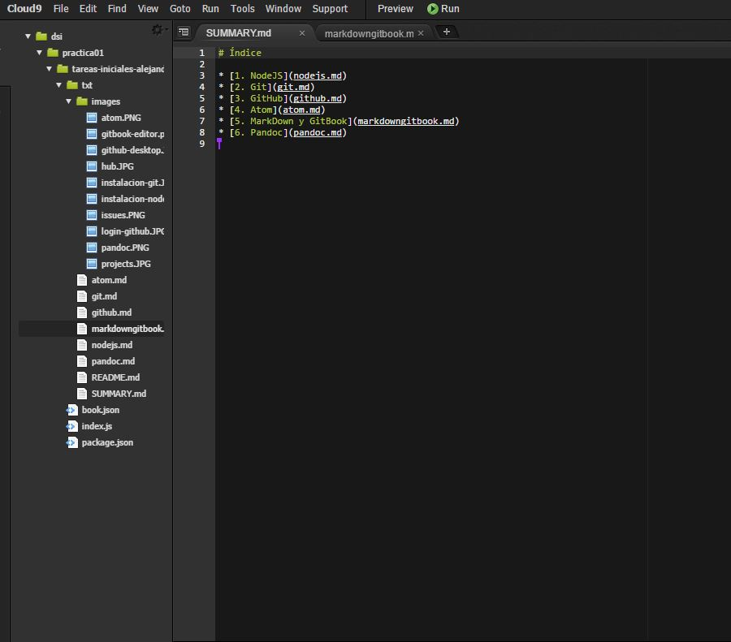

# Cloud 9

Cloud 9 es un IDE online muy útil para programar, desarrollo web, etc. Además funciona de tal manera que puedes estar programando en equipo simultáneamente y cada uno desarrollando una parte del código y viendo lo que los demás hacen, por lo que es una herramienta muy potente. En este caso clonaremos nuestro repositorio en el cloud 9 para familiarizarnos con la herramienta.

