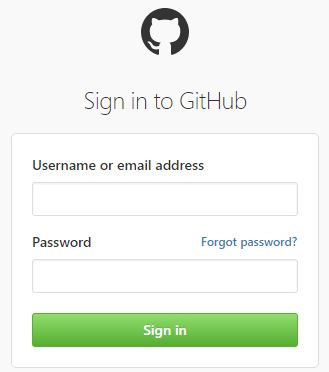
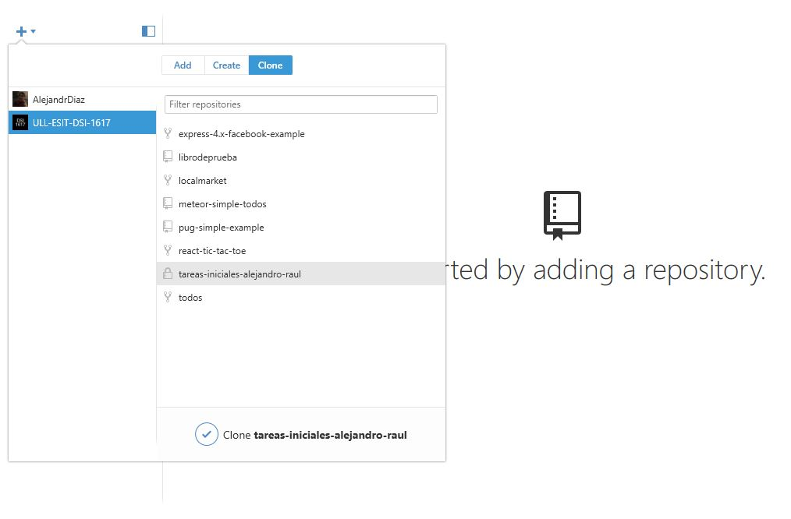
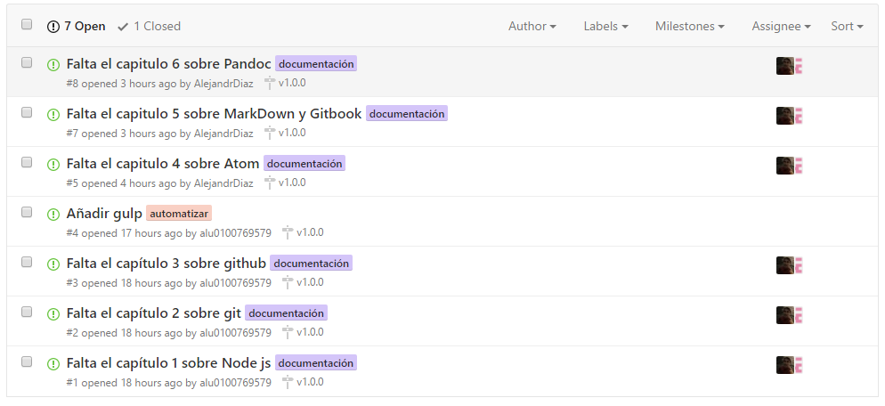
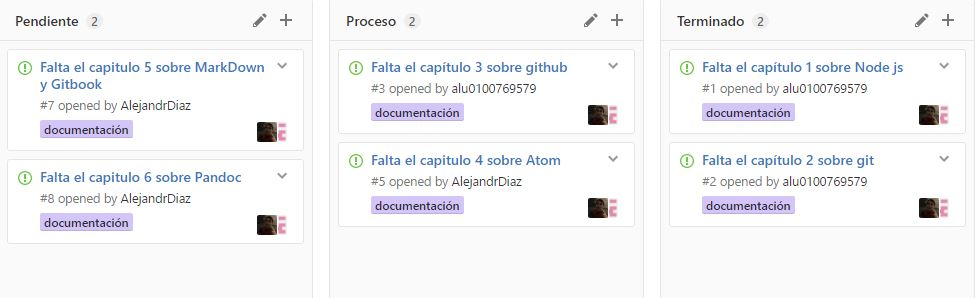
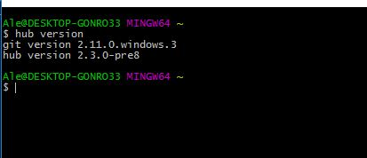

# GitHub
En este capitulo debemos en primer lugar crearnos una cuenta en GitHub si no lo hemos hecho ya, aunque en nuestro caso la cuenta ya estaba creada por lo que solo tuvimos que loguearnos con nuestras respectivas cuentas.




El siguiente paso fue instalar GitHub Desktop si utilizas Mac o Windows ya que te facilita el uso de GitHub, aquí exponemos un ejemplo de su uso.



### Issues
Dentro de nuestro repositorio, tenemos una pestaña referente a las Issues, con las que se irán añadiendo tareas, solicitudes de documentación en específico y todo tipo de solicitud al equipo de desarrollo. A cada issue se le puede asignar una etiqueta para organizarlos de mejor manera, o asignar el issue a una persona en concreta entre otras cosas.



### Gh-Pages

Las "gh-pages" son usadas para publicar en GitHub tus trabajos y que puedan ser vistos, como puede ser una web o un blog.

### Projects

Dentro del repositorio usamos la pestaña "Proyectos" para realimentar el repositorio a medida que vamos realizando las issues, es decir, vamos poniendo las tareas en pendientes, en proceso o completadas según se vaya avanzando, para así tener constancia de las tareas que se van realizando.



### Hub

Hub es utilizado para potenciar los comandos de  Git y que funcionen mejor en GitHub. Para instalarlo en Windows debes escoger la opción que dice "Standalone", al acceder saldrán varias opciones en las que elegirás la que se adapte a tu sistema operativo de 32 o 64 bits. Después de descargar el archivo deberás descomprimir el .rar dentro de la carpeta de instalación de Git, tras esto deberías poder escribir en la línea de comandos:

```
hub version
```


