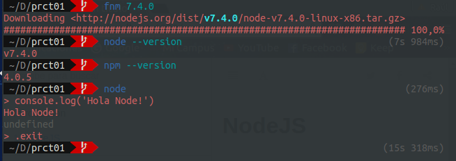

# NodeJS

En este apartado se va a realizar la instalación de NodeJS. Para ello habrá que ejecutar el comando fnm, ya que se está utilizando la shell de Fish, en el caso de hacerlo desde la bash se utilizaría el comando nvm. En la siguiente imagen se puede ver la instalación y la prueba de que está instalado.

