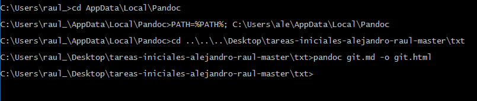

# Pandoc

Pandoc es una aplicación que permite convertir un archivo Markdown en formato Latex, HTM, PDF entre otros muchos más formatos. Para la instalación en Windows sólo hay que seguir el asistente de instalación.

Para empezar a usarlo primero habrá que ejecutar el comando **_PATH=%PATH%; C:\Users\ale\AppData\Local\Pandoc_** y después en la dirección donde se encuentra el archivo.md que se quiere convertir a html el comando **_pandoc index.md -o index.html_**.

Por último hay que añadir la codificación utf-8 al archivo html para que se muestren bien las tildes y caracteres raros.

